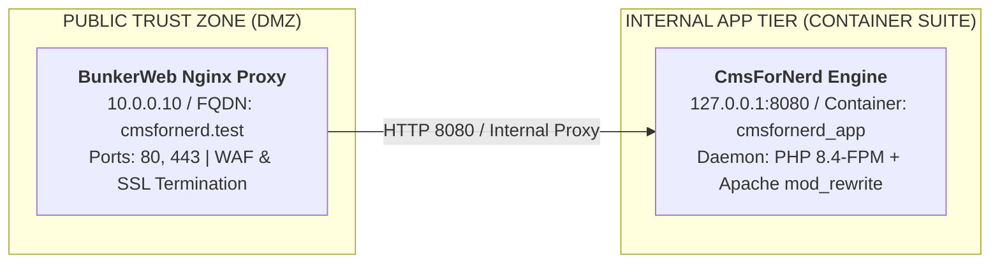

# 📐 Diagram Design Standards and Visual Specifications

## Purpose
The `diagram-design-standards` skill establishes a standardized 3-part format for generating technical diagrams, network topologies, infrastructure architectures, and data flows across CmsForNerd documentation and AI agent outputs. Every diagram generated under this standard must contain:
1. A Standalone Production-Ready SVG Vector Graphic inside an `xml` code fence.
2. A Git-Native Mermaid Diagram inside a `mermaid` code fence directly beneath the SVG block.
3. A Summary Interface & Routing Table concluding the section.

## When to use this skill
Trigger this skill whenever asked to "generate a diagram", "draw architecture", "create network flow", "design system topology", "visualize infrastructure", or when generating visual documentation and system architecture specifications.

## Guidelines & Best Practices

### 1. Standalone Production-Ready SVG Vector Graphic (.svg)
Generate a self-contained, fully compliant raw SVG vector block inside a single `xml` code fence matching these styling constraints:

- **Canvas Hygiene**:
  - Explicit `xmlns="http://www.w3.org/2000/svg"`.
  - Explicit `viewBox` (e.g. `viewBox="0 0 800 500"`).
  - Explicit `width="100%"` and `height="100%"`.

- **Palette & Design System**:
  - **Background**: Slate/Off-white canvas (`#F8FAFC` or `#FFFFFF`).
  - **Borders & Boxes**: Crisp rounded container cards (`rx="8"` or `rx="10"`), subtle card strokes (`#CBD5E1`, `#94A3B8`, or `#E2E8F0`), and light container headers (`#EFF6FF`, `#F1F5F9`, or `#DCFCE7`).
  - **Typography**: Modern sans-serif typography stack (`font-family="-apple-system, BlinkMacSystemFont, 'Segoe UI', Roboto, Helvetica, Arial, sans-serif"`). Monospace font (`Consolas`, `Monaco`, or `'Courier New'`) for IP addresses, CIDRs, file paths, and network ports.

- **Structural Precision**:
  - Define explicit arrow markers (`<marker>`) inside `<defs>`.
  - Group logical subnets, tiers, or security boundaries into distinct container rectangles with uppercase section headers.
  - Every card must contain: entity title (bold), primary network/system identifier (IP, FQDN, or ID), and key functional metadata (ports, daemons, or roles).
  - Direct all connection paths (`<path>` or `<line>`) with explicit coordinates and distinct port/protocol callout pill badges.

### 2. Git-Native Mermaid Diagram (.mmd / Mermaid Block)
Directly beneath the SVG block, generate an equivalent, character-exact Mermaid diagram inside a single `mermaid` code fence:

- **Orientation**: Choose the most readable layout (`graph TD`, `graph LR`, or `sequenceDiagram`).
- **Grouping**: Enclose security tiers, VLANs, clusters, or operational domains inside explicit `subgraph` blocks.
- **Label Precision**: Display clear port bindings, protocol indicators, and service actions along link connectors (e.g., `-->|"TCP 5432 / mTLS"|` or `-->|"SSH Port 22"|`).
- **Readability**: Break long node labels across multiple lines using HTML break tags (`<br/>`).

### 3. Summary Interface & Routing Table
Conclude with a clean Markdown comparison table summarizing:
- **Source Component**: The originating service, client, or security zone.
- **Target Component**: The destination service, host, or container.
- **Port / Protocol / API Ingress**: Network port, protocol layer, and API entry point.
- **Security Boundary / Trust Zone / Access Key**: Trust level, authentication layer, or authorization token.
- **Operational Significance / Flow Description**: Functional purpose of the data or network flow.

---

## 🎨 Exemplary 3-Part Standard Template

```xml
<svg xmlns="http://www.w3.org/2000/svg" viewBox="0 0 800 400" width="100%" height="100%">
  <defs>
    <marker id="arrow" viewBox="0 0 10 10" refX="6" refY="5" markerWidth="6" markerHeight="6" orient="auto-start-reverse">
      <path d="M 0 0 L 10 5 L 0 10 z" fill="#475569" />
    </marker>
  </defs>

  <!-- Background Canvas -->
  <rect width="100%" height="100%" fill="#F8FAFC" rx="8" />

  <!-- Container Tier: Ingress Boundary -->
  <rect x="20" y="20" width="360" height="360" fill="#FFFFFF" stroke="#CBD5E1" stroke-width="1.5" rx="10" />
  <rect x="20" y="20" width="360" height="35" fill="#EFF6FF" rx="10" />
  <text x="35" y="43" font-family="-apple-system, BlinkMacSystemFont, 'Segoe UI', Roboto, sans-serif" font-size="12" font-weight="bold" fill="#1E40AF">PUBLIC TRUST ZONE (DMZ)</text>

  <!-- Node: Reverse Proxy Card -->
  <rect x="40" y="80" width="320" height="100" fill="#FFFFFF" stroke="#94A3B8" stroke-width="1" rx="8" />
  <text x="55" y="105" font-family="-apple-system, BlinkMacSystemFont, 'Segoe UI', Roboto, sans-serif" font-size="14" font-weight="bold" fill="#0F172A">BunkerWeb Nginx Proxy</text>
  <text x="55" y="125" font-family="Consolas, Monaco, monospace" font-size="12" fill="#2563EB">10.0.0.10 / FQDN: cmsfornerd.test</text>
  <text x="55" y="145" font-family="-apple-system, BlinkMacSystemFont, 'Segoe UI', Roboto, sans-serif" font-size="11" fill="#64748B">Ports: 80, 443 | WAF &amp; SSL Termination</text>

  <!-- Container Tier: App Tier Boundary -->
  <rect x="420" y="20" width="360" height="360" fill="#FFFFFF" stroke="#CBD5E1" stroke-width="1.5" rx="10" />
  <rect x="420" y="20" width="360" height="35" fill="#DCFCE7" rx="10" />
  <text x="435" y="43" font-family="-apple-system, BlinkMacSystemFont, 'Segoe UI', Roboto, sans-serif" font-size="12" font-weight="bold" fill="#166534">INTERNAL APP TIER (CONTAINER SUITE)</text>

  <!-- Node: PHP-FPM Engine Card -->
  <rect x="440" y="80" width="320" height="100" fill="#FFFFFF" stroke="#94A3B8" stroke-width="1" rx="8" />
  <text x="455" y="105" font-family="-apple-system, BlinkMacSystemFont, 'Segoe UI', Roboto, sans-serif" font-size="14" font-weight="bold" fill="#0F172A">CmsForNerd Engine</text>
  <text x="455" y="125" font-family="Consolas, Monaco, monospace" font-size="12" fill="#16A34A">127.0.0.1:8080 / Container: cmsfornerd_app</text>
  <text x="455" y="145" font-family="-apple-system, BlinkMacSystemFont, 'Segoe UI', Roboto, sans-serif" font-size="11" fill="#64748B">Daemon: PHP 8.4-FPM + Apache mod_rewrite</text>

  <!-- Connection Path -->
  <path d="M 360 130 L 440 130" stroke="#475569" stroke-width="2" marker-end="url(#arrow)" />

  <!-- Protocol Badge -->
  <rect x="375" y="115" width="50" height="20" fill="#E2E8F0" rx="4" />
  <text x="400" y="129" font-family="Consolas, Monaco, monospace" font-size="10" fill="#334155" text-anchor="middle">HTTP/8080</text>
</svg>
```



### Summary Interface & Routing Table

| Source Component | Target Component | Port / Protocol / API Ingress | Security Boundary / Trust Zone / Access Key | Operational Significance / Flow Description |
| :--- | :--- | :--- | :--- | :--- |
| **Client / Internet** | **BunkerWeb Nginx Proxy** | `TCP 80, 443 / HTTPS` | Public Internet -> DMZ | External user entry point with WAF inspection and TLS termination. |
| **BunkerWeb Nginx Proxy** | **CmsForNerd Engine** | `TCP 8080 / HTTP` | DMZ -> Internal Container Network | Forwarding clean HTTP requests to backend PHP 8.4 container engine. |

---
*Deep State of Mind (DSOM) For My AI Protocol | Harisfazillah Jamel (LinuxMalaysia) | 2026-08-01*
*Standard: UK English | DBP-standard Bahasa Melayu Malaysia (Piawai) | GNU General Public License v3.0*
