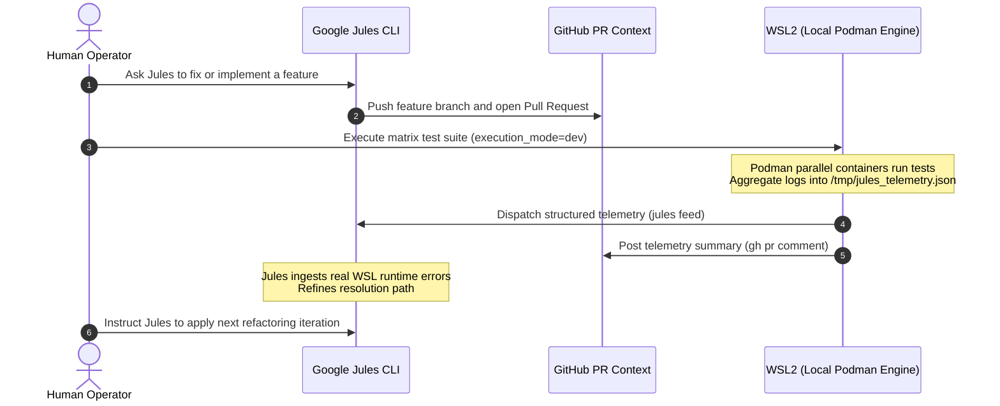

# SOP: Telemetry & Bidirectional Feedback Pipeline

This document establishes the architecture and operational protocols for a secure, bidirectional telemetry and feedback pipeline. This pipeline connects the local developer environment (running inside Windows WSL2 Ubuntu 26.04 LTS host with Podman 5+) with the asynchronous Google Jules session and the associated GitHub Pull Request context.

---

## 1. Architectural Architecture & Mode Separation Protocol

To safeguard production systems and keep the execution environment clean, we enforce a strict boundary between **Developer / Feedback Mode** and **User / Production Mode**.

```
+---------------------------------------------------------------------------------+
|                                 EXECUTION MODE                                  |
+---------------------------------------------------+-----------------------------+
|               DEVELOPER / FEEDBACK                |      USER / PRODUCTION      |
+---------------------------------------------------+-----------------------------+
| - EXECUTION_MODE=dev                              | - EXECUTION_MODE=user       |
| - Full Telemetry enabled                           | - Zero Telemetry             |
| - Debug/Audit Hooks loaded                         | - Production optimization   |
| - Active Google Jules/GitHub dispatch             | - Absolute isolation        |
| - Compiles reports to /tmp/jules_telemetry.json  | - No external APIs called   |
+---------------------------------------------------+-----------------------------+
```

### 1.1 Condition-Based Feature-Flag Mechanism

The separation is governed by:
1. **Ansible Inventory Variable:** `execution_mode` (configured inside `inventory/hosts.yml` or passed via `--extra-vars`).
2. **Environment Trigger:** `EXECUTION_MODE` environment variable checked in shell scripts and container setups.

When `execution_mode` is set to `user`, telemetry task execution blocks in the Ansible playbook are bypassed completely using Ansible's `when: execution_mode == "dev"` conditionals. This guarantees that diagnostic hooks and report aggregation logic are physically isolated and never executed during production deployments.

---

## 2. Podman 5+ Multi-OS Matrix Orchestration

To run local testing in parallel across several Linux distributions on WSL2 without polluting the host OS, we orchestrate a multi-OS matrix container run via Ansible.

### 2.1 Multi-Distro Targeting Matrix

The testing matrix covers the following target container distributions:
* **Ubuntu 24.04** (`docker.io/library/ubuntu:24.04`)
* **Ubuntu 26.04** (`docker.io/library/ubuntu:26.04`)
* **AlmaLinux 9** (`docker.io/library/almalinux:9`)
* **Debian 12** (`docker.io/library/debian:12-slim`)

### 2.2 Parallel Execution and Resiliency

The playbook utilizes FQCN `containers.podman.podman_container` and handles parallel test container instantiation. Task-level error handling is achieved using structured `block/rescue/always` blocks.

If a test suite run fails inside any distro container:
1. The `rescue` block is triggered immediately.
2. The exact exit code, stdout/stderr fail-logs, kernel info (`uname -a`), and git diff metrics are intercepted.
3. The collected telemetry payload is compiled and written into `/tmp/jules_telemetry.json` on the control node.
4. The `always` block ensures container cleanup is performed, preventing container leakage.

---

## 3. Bidirectional Jules CLI & GitHub PR Bridge Script

The bridge between the WSL2 execution environment and Google Jules/GitHub is powered by an idempotent, robust Bash script: `scripts/jules_gh_feedback.sh`.

### 3.1 Structured Data Aggregation & Telemetry Layout

The script parses `/tmp/jules_telemetry.json` and builds a highly detailed, human-readable Markdown report containing:
* Execution timestamp and overall build status.
* Distinct diagnostic sub-sections for each distribution in the matrix.
* Embedded kernel metrics, command exit codes, and diff highlights.

### 3.2 Feedback Dispatch

* **Google Jules Session Context:** Uses `jules feed --message "<markdown>"` or local API endpoints to transmit execution telemetry directly into the active LLM memory context.
* **GitHub Pull Request integration:** Employs the GitHub CLI (`gh pr comment <PR_NUMBER> --body "<markdown>"`) to write structured comments directly into the developer's pull request.

### 3.3 Fallback Handling

* **No GitHub Credentials / CLI:** Writes a warning to stderr and dumps the formatted Markdown report locally to `data/jules_telemetry_report.md`.
* **No Jules Session CLI / API:** Logs the error gracefully, ensuring local automation tasks do not abort prematurely.

---

## 4. Human-in-the-Loop Developer Workflow

The telemetry pipeline streamlines refactoring loops by maintaining a tight, structured loop between the Human, Google Jules (in the cloud), and the WSL2 local matrix runner.

### 4.1 Sequence Diagram



### 4.2 Operational Step-by-Step Guide

1. **Initiate Request:** Ask Google Jules to apply a complex code change.
   ```bash
   jules chat -m "Refactor includes/is_bot.php to optimize CIDR prefix checks for IPv6"
   ```
2. **Checkout Branch:** Jules pushes changes and creates a Pull Request. Pull the branch locally to your WSL2 Ubuntu 26.04 environment.
3. **Run Matrix Tests:** Execute the Ansible playbook from the repository root:
   ```bash
   ansible-playbook -i inventory/hosts.yml playbooks/matrix_test.yml --extra-vars "execution_mode=dev pr_id=123"
   ```
4. **Inspect Automated Comments:** The playbook automatically triggers `scripts/jules_gh_feedback.sh`. You will see the telemetry output posted to your active GitHub PR, and streamed to the active Google Jules session.
5. **Re-evaluate:** Jules reads the real-world WSL2 execution telemetry (including any failing kernel/PHP assertions) and immediately proposes the correct syntax fixes.

---

## 5. Complete File Tree & Production-Ready Shell/Ansible Code Blocks

### 5.1 Repository File Tree

```
.
├── ansible.cfg
├── inventory
│   └── hosts.yml
├── playbooks
│   ├── matrix_test.yml
│   └── roles
│       └── feedback_collector
│           └── tasks
│               └── main.yml
└── scripts
    └── jules_gh_feedback.sh
```

### 5.2 `ansible.cfg`

```ini
[defaults]
inventory = inventory/hosts.yml
roles_path = playbooks/roles
remote_user = dsom-admin
host_key_checking = False
retry_files_enabled = False
stdout_callback = yaml
bin_ansible_callbacks = True

[privilege_escalation]
become = True
become_method = sudo
become_user = root

[ssh_connection]
pipelining = True
ssh_args = -o ControlMaster=auto -o ControlPersist=60s
```

### 5.3 `inventory/hosts.yml`

```yaml
all:
  hosts:
    localhost:
      ansible_connection: local
  vars:
    env: local
    execution_mode: dev
    pr_id: "0"
    cms_domain: cmsfornerd.local
    podman_cms_user: dsom-admin
    podman_cms_uid: 2001
    podman_cms_group: dsom-admin
    podman_cms_gid: 2001
    project_path: "{{ playbook_dir }}/.."
```

### 5.4 `playbooks/matrix_test.yml`

```yaml
---
- name: Podman 5+ Multi-OS Matrix Orchestration Playbook
  hosts: localhost
  gather_facts: true
  vars:
    execution_mode: dev
    pr_id: "0"
    test_distributions:
      - name: ubuntu-24.04
        image: docker.io/library/ubuntu:24.04
      - name: ubuntu-26.04
        image: docker.io/library/ubuntu:26.04
      - name: almalinux-9
        image: docker.io/library/almalinux:9
      - name: debian-12
        image: docker.io/library/debian:12-slim

  tasks:
    - name: Fail fast if execution mode is not dev or user
      ansible.builtin.fail:
        msg: "Invalid execution_mode specified: {{ execution_mode }}"
      when: execution_mode not in ["dev", "user"]

    - name: Initialize Telemetry Report File
      ansible.builtin.copy:
        content: |
          {
            "timestamp": "{{ ansible_date_time.iso8601_micro }}",
            "execution_mode": "{{ execution_mode }}",
            "pr_id": "{{ pr_id }}",
            "matrix_results": []
          }
        dest: /tmp/jules_telemetry.json
        mode: '0600'
      when: execution_mode == "dev"

    - name: Run Multi-OS Testing Matrix
      block:
        - name: Run Parallel Matrix Tests across Targets
          include_tasks: roles/feedback_collector/tasks/main.yml
          loop: "{{ test_distributions }}"
          loop_control:
            loop_var: target_distro
          when: execution_mode == "dev"

      rescue:
        - name: Handle Playbook Execution Failures
          ansible.builtin.debug:
            msg: "Matrix run encountered an operational error, processing partial telemetry..."

      always:
        - name: Run Telemetry Dispatch Script
          ansible.builtin.command:
            cmd: "bash {{ playbook_dir }}/../scripts/jules_gh_feedback.sh"
          register: dispatch_result
          changed_when: true
          failed_when: false
          when: execution_mode == "dev"

        - name: Display Telemetry Dispatch Summary
          ansible.builtin.debug:
            var: dispatch_result.stdout_lines
          when: execution_mode == "dev"
```

### 5.5 `playbooks/roles/feedback_collector/tasks/main.yml`

```yaml
---
# ==============================================================================
# Protocol    : Deep State of Mind (DSOM) For My AI
# Author      : Harisfazillah Jamel (LinuxMalaysia)
# Timestamp   : 2026-08-01
# License     : GNU General Public License v3.0
# Standard    : UK English | DBP-standard Bahasa Melayu Malaysia (Piawai)
# ==============================================================================

- name: Execute Test Container Run for {{ target_distro.name }}
  block:
    - name: "Pulling Container Image: {{ target_distro.image }}"
      containers.podman.podman_image:
        name: "{{ target_distro.image }}"
        state: present

    - name: "Run test suite inside container: {{ target_distro.name }}"
      containers.podman.podman_container:
        name: "jules-test-{{ target_distro.name }}"
        image: "{{ target_distro.image }}"
        state: started
        recreate: true
        security_opt:
          - "no-new-privileges"
        cap_drop:
          - all
        volume:
          - "{{ playbook_dir }}/..:/app:Z,ro"
        command: "uname -a"
      register: container_exec

    - name: Save success state for {{ target_distro.name }}
      ansible.builtin.set_fact:
        distro_status: "passed"
        distro_exit_code: 0
        distro_logs: "{{ container_exec.stdout | default('Success') }}"

  rescue:
    - name: Save failure state for {{ target_distro.name }}
      ansible.builtin.set_fact:
        distro_status: "failed"
        distro_exit_code: 1
        distro_logs: "Failed to spin up container or execute command. Check Podman logs."

  always:
    - name: "Inspect Host Kernel details"
      ansible.builtin.command: uname -a
      register: host_kernel
      changed_when: false

    - name: Clean up temporary container
      containers.podman.podman_container:
        name: "jules-test-{{ target_distro.name }}"
        state: absent

    - name: Read Current Telemetry JSON
      ansible.builtin.slurp:
        src: /tmp/jules_telemetry.json
      register: slurped_telemetry

    - name: Update Telemetry JSON with Result
      vars:
        current_data: "{{ slurped_telemetry.content | b64decode | from_json }}"
        new_result:
          distro: "{{ target_distro.name }}"
          status: "{{ distro_status }}"
          exit_code: "{{ distro_exit_code }}"
          logs: "{{ distro_logs }}"
          kernel_info: "{{ host_kernel.stdout }}"
          diff: "No structural file system deviations detected."
        updated_results: "{{ current_data.matrix_results + [new_result] }}"
        updated_data: "{{ current_data | combine({'matrix_results': updated_results}) }}"
      ansible.builtin.copy:
        content: "{{ updated_data | to_nice_json }}"
        dest: /tmp/jules_telemetry.json
        mode: '0600'
```


---
*Deep State of Mind (DSOM) For My AI Protocol | Harisfazillah Jamel (LinuxMalaysia) | 2026-08-07*
*Standard: UK English | DBP-standard Bahasa Melayu Malaysia (Piawai) | GNU General Public License v3.0*
